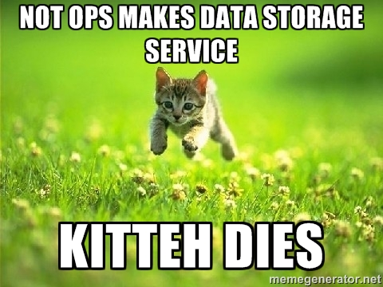

# SmallTable: a Postbin and Small Data Storage Service

##Claims:

1. This is a modest request.
2. The modesty of it is what prevents Data Ops from having already implemented it.
3. These things will not bite you.  They are quite tame.

4. Everytime a reasearcher, ux-er, or engineer has to think about spinning up Yet Another Datastore, **10 kittens die**.

5. Doing Things Right (instrumenting using FHR and Telemetry) is Awesome, but not always Practical.

6. Ops is SUPER HARD, and should be left to the Specialists.

7. Getting this right and Awesome will make whoever does it immediately become Vice President of awesome.

8. For the right person / team, this is a two day job to get to MVP.  It is a one month job to make it SUPER AWESOME.

9.  When you know the magic string, you can store most anything.

## Why building this should excite you.

###  Lots of people in Mozilla need to store modest amounts of data.  Please help them.

1. Experimenters, including UX, UA, Content Services.
2. Web Service and Service Ops prototypers.

**You will serve all the people on high visibility projects, and they will love you**

### We already do hosted services for

- documents (gdocs, etherpad)
- code (hg, pastebin, gits)
- urls
- DOM objects (pageshot)

We are missing ones for

- data blobs
- images

**Your itch to OWN ALL THE THINGS will be scratched**

## Goals:
1. high availability.  uptime guarantees and monitoring.  Reliable.
2. no packets dropped (within reason!)
3. users are NOT OPS.  Users should not be admins on the hosting machines.  They should **NOT** know where the machines are, or care.
4. forgiveness over permission.  It's up to ops to warn you if you are getting close to overflowing.  It's up to you to prevent it.

## Fantasy:

1.  `smalltable.mozilla.com/some_project/create` to create

    - who owns this (so they can get yelled at)
    - validators (optional)
    - intended type of data (optional)

2.  POST blob to `smalltable.mozilla.com/some_project`
3.  see all posted blobs at `smalltable.mozilla.com/some_project/index.html` (ldap?)

## Assumptions

1.  Users are unix-aware, and will accept CLI solutions
2.  LDAP is fine.  VPN is fine.
3.  Company public is default for all stored data.

## Requirements:

### creation

1. easy to create.  One form at most, self-service!
2. on demand namespacing.

### data storage

1. POST json works as you'd expect.
2. POST other text works as you'd expect.

## Unrequirements:

These are NOT WANTED.  Seriously, DO NOT BLOCK ON THESE.

1. infinite storage.  These are FINITE, SMALL data sets.
2. infinite retention.  Trash them all after a year, or 6 months if you want!

## Nice to haves

1. Some querying / indexing / filtering.  AdHoc no-sql is better.
2. (optional) Validation at server, with error notices for malformed.
3. Stats on usage, flux, etc.
4. Retrieve by recordid.
5. Real-time 'tail the store'

## Some architectures that would probably work:
- hosted mongodb service
- flask (for subdomain routing) => heka (uptime) => append to s3 (storage)
- apache + modRewrite => log-rotate the access logs, which contain the POST data.
- http://aws.amazon.com/kinesis/

